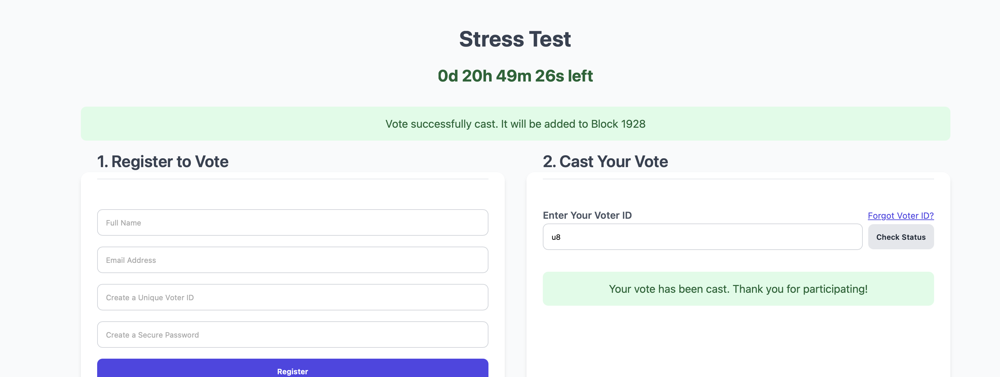

## Decentralized E-Voting Platform

Decentralized e-voting application powered by a custom blockchain running via Flask backend.

It features a secure, time-limited campaign system, robust voter authentication, and a transparent, immutable ledger for all votes.


### Technology Stack
**Frontend:** React (Vite)

**Backend:** Python (Flask)

**Database:** PostgreSQL (Dockerized)

**Load Testing:** Locust.
For stress-testing the application's performance and stability under heavy concurrent loads.


### Configure the Backend Environment


- Create a .env file into the backend directory(Already there)

-  From the backend directory, start the database container :

`docker-compose up -d`


- Initialize the Database (First-Time Setup Only): Before starting the Flask server for the first time, you must create the necessary tables in the database.


Set up a Python virtual environment and install dependencies:

```bash
python3 -m venv venv
source venv/bin/activate
pip install -r requirements.txt
```

Set the FLASK_APP environment variable and Run the database initialization command:

```bash
export FLASK_APP=blockchain.py
flask init-db
# You should see the message: Initialized the database.
```


- Run the Flask Server:
```bash
python3 blockchain.py
```

### Serve the Frontend

`cd ../frontend`

Install the Node.js dependencies:
```bash
npm install
npm run dev
```

Go to the web interface (http://localhost:5173)


### Screenshots

**Homepage**


**Campaign Voting page**


**Voter Registration for a Campaign**


**Vote Casting by providing the Voter ID and password**





**Trying to revote with same ID**


**Forgot Voter ID?**


**Voting Results**


**Admin Page Login**


**Admin Page - Campaign Creation**


**Admin Page - Campaign Voters**


**Admin Page - Blockchain Activity**


### Important Considerations

- **Blockchain Persistence:** The current implementation stores the blockchain (the list of votes) in memory. This means that if the Python server restarts, all vote data will be lost.

- **Scalability:** The current application runs as a single instance. The primary performance bottlenecks identified during testing are CPU (for password hashing and mining) and the database connection pool. To scale, you would need to do vertical scaling.


### Stress Testing

Run Locust : `locust -f locustfile.py`

Go to the web interface (http://localhost:8089)

When you start the swarm, the "Number of users" you enter will now be distributed between Voters and Admins based on the weights we set.

Number of users: Enter the total number of concurrent users you want to simulate (e.g., 1000).

Spawn rate: Enter how many users to start per second (e.g., 10). This will gradually ramp up the load.


### Todo:
- Blockchain Persistence
- Full Admin Authentication with JWT
- Distributed Nodes & Consensus (If one server goes down, the network continues to operate, ensuring the election is never interrupted.)
- Vote Encryption (Even an admin looking at the raw blockchain data cannot see how any individual voted.)
- Voter Email Confirmation and Voter Auditing Trail (After a voter successfully casts their voe, provide them with a unique, anonymous "tracking code" They could later enter this code on a public page to verify that a transaction with their tracking code)
